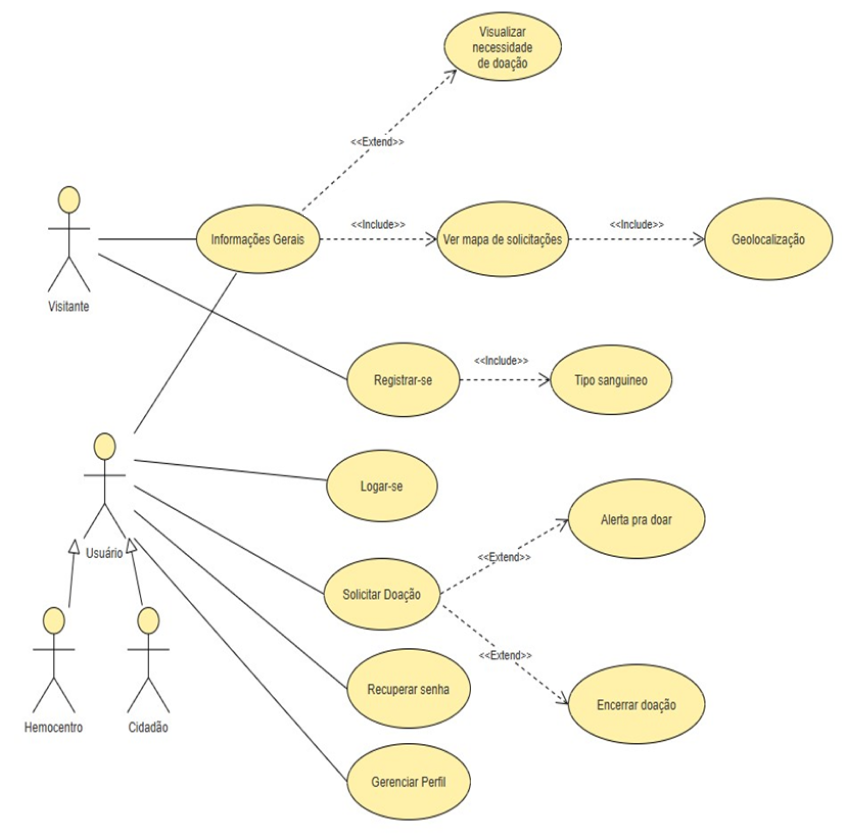

  

[circleci-image]: https://img.shields.io/circleci/build/github/nestjs/nest/master?token=abc123def456
[circleci-url]: https://circleci.com/gh/nestjs/nest

  
Conectando vidas através da solidariedade. Uma plataforma que facilita a doação de sangue e salva vidas todos os dias.

    

## Sobre o Projeto
A plataforma SANGUE SOLIDÁRIO visa facilitar a doação de sangue promovendo conscientização sobre o tema, conectando doadores a pessoas ou hemocentros necessitados e vice-versa através de um website completo.

O Sangue Solidário Frontend é uma aplicação web moderna desenvolvida com Next.js 15 que facilita a conexão entre doadores de sangue e instituições de saúde.

## Casos de Uso

  

    <h3>Requisitos Funcionais (RF)</h3>
    <table border="1" cellspacing="0" cellpadding="6">
      <tr><th>Código</th><th>Funcionalidade</th><th>Descrição</th></tr>
      <tr><td>RF001</td><td>Landing Page</td><td>Fornece informações gerais sobre as doações necessárias em sua região, com base na localização do dispositivo ou da seleção feita pelo usuário.</td></tr>
      <tr><td>RF002</td><td>Cadastro de doação</td><td>Cadastrar as informações relacionadas às necessidades de doações de usuários (pessoas físicas ou hemocentros).</td></tr>
      <tr><td>RF003</td><td>Visualização de necessidades de doação</td><td>Fornece detalhes sobre as necessidades de doações que o usuário deseja atender/auxiliar.</td></tr>
      <tr><td>RF004</td><td>Listagem de necessidades de doação</td><td>Fornece uma lista de necessidade de doação ordenada por tipo sanguíneo predefinido pelo usuário com base em seu cadastro.</td></tr>
      <tr><td>RF005</td><td>Cadastro de usuário</td><td>Cadastrar usuário (cidadão, hospitais e/ou hemocentros).</td></tr>
      <tr><td>RF006</td><td>Blog</td><td>Fornecer textos, áudios, vídeos ou links externos relacionados a doação de sangue/questões de saúde pública.</td></tr>
      <tr><td>RF007</td><td>Localização</td><td>Sinalizar os hemocentros mais próximos da sua localização atual ou da cidade selecionada.</td></tr>
      <tr><td>RF009</td><td>Alerta de doação</td><td>Alertar o usuário, dentro do próprio site, que ele está apto a doar após o tempo de espera baseado em sua última doação.</td></tr>
      <tr><td>RF010</td><td>Monetização</td><td>Website arrecada monetização por meio de anúncios contratados via formulário de contato e através de doações que podem ser feitas por qualquer usuário.</td></tr>
      <tr><td>RF011</td><td>Gerenciamento de perfil</td><td>Os usuários cadastrados, sejam cidadãos ou hemocentro/hospitais poderão gerenciar seu perfil na plataforma.</td></tr>
    </table>
  

  

    <h3>Requisitos Não Funcionais (RNF)</h3>
    <table border="1" cellspacing="0" cellpadding="6">
      <tr><th>Código</th><th>Requisito Não Funcional</th></tr>
      <tr><td>RNF001</td><td>As informações dos usuários, como dados pessoais e localização, devem ser protegidas por criptografia, utilizando protocolos de segurança como HTTPS e armazenamento seguro.</td></tr>
      <tr><td>RNF002</td><td>Deve seguir as normas de proteção de dados (como a LGPD no Brasil) para garantir a privacidade dos dados dos doadores e instituições.</td></tr>
      <tr><td>RNF003</td><td>Backup automático de dados deve ser realizado diariamente, com plano de recuperação em caso de falha do sistema.</td></tr>
      <tr><td>RNF004</td><td>O código-fonte deve ser modular e seguir boas práticas de desenvolvimento, para facilitar futuras correções e atualizações.</td></tr>
      <tr><td>RNF005</td><td>Deve haver documentação clara e detalhada do código e do design do sistema, facilitando a manutenção por diferentes equipes.</td></tr>
      <tr><td>RNF006</td><td>O site deve ser intuitivo e acessível a usuários de diferentes perfis, incluindo suporte a acessibilidade.</td></tr>
      <tr><td>RNF007</td><td>O sistema deve ser compatível com os principais navegadores (Chrome, Firefox, Safari, Edge).</td></tr>
      <tr><td>RNF008</td><td>A infraestrutura do sistema deve ser eficiente em termos de uso de recursos, como energia e processamento, reduzindo a pegada de carbono e o custo operacional.</td></tr>
    </table>
  

## Sprints
| Sprint | Período | Status | Entregas / O que foi feito |
|:-------:|:--------:|:--------:|:----------------------------|
| Sprint 1 | 15/09/2025 – 29/09/2025 | Concluída | *(adicione aqui o que foi desenvolvido nesta sprint)* |
| Sprint 2 | 29/09/2025 – 13/10/2025 | Concluída | *(adicione aqui as funcionalidades entregues nesta sprint)* |
| Sprint 3 | 13/10/2025 – 27/10/2025 | Concluída | *(adicione aqui melhorias, correções ou novas features)* |
| Sprint 4 | 28/10/2025 – 11/11/2025 | Em andamento | *(adicione o que está sendo desenvolvido)* |

## Tecnologias

##  Colaboradores

| Nome | Função |
|------|---------|
| Caio Cesar Martins de Lima | Product Owner |
| Ysrael Moreno | Scrum Master |